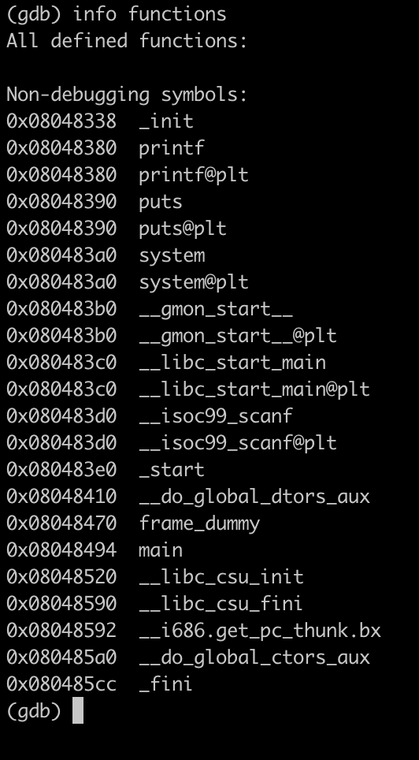
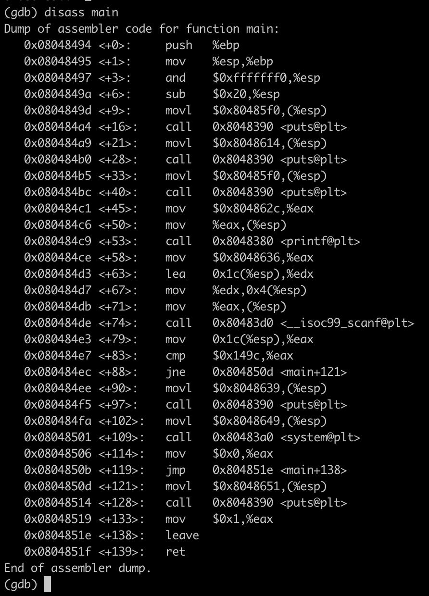
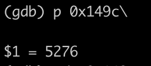

# Check functions

Only `main`

# Main disass

We can see calling `scanf`, make comparing after it and calls `system` when `cmp` is true.

# Data

Let's print the value from `cmp` command at `<+83>`

It seems it's our password `5276`
