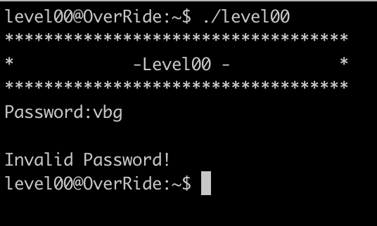
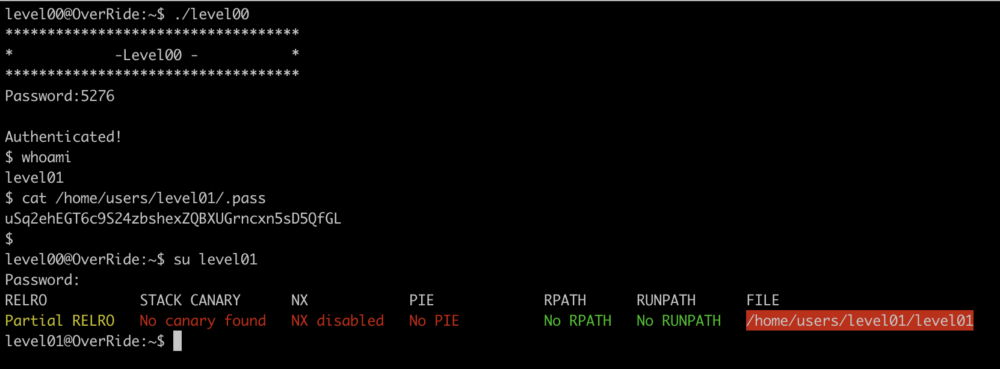

# Level00

The program waits the password as input. Let's use [gdb](Ressources/gdb.md) to understand what's going on. 

This binary reads our input via `scanf`, compares it with `5276`. If our input is right, it launches `system`

