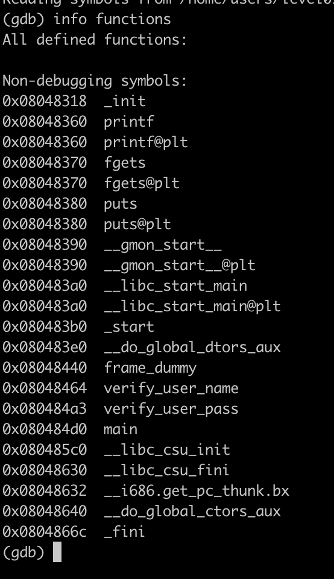
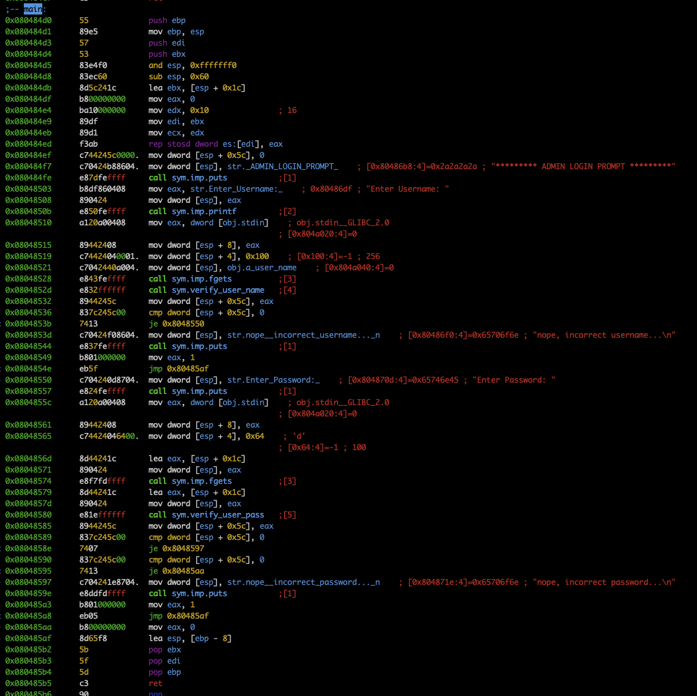
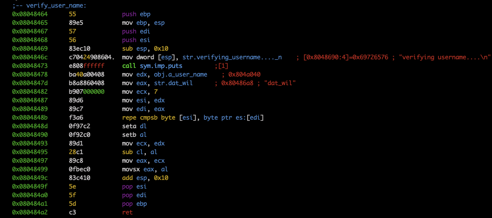
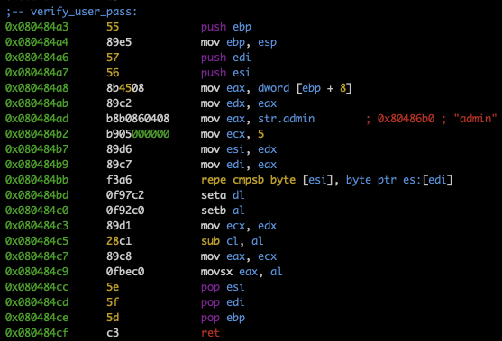

# Check functions

There are 3 functions: `main`, `verify_user_name`, `verify_user_pass`

# Main disass

We should find right username and password. Check corresponding functions

# Verify user name disass

Username `dat_wil` is right

# Verify user pass disass

Password `admin` is right
