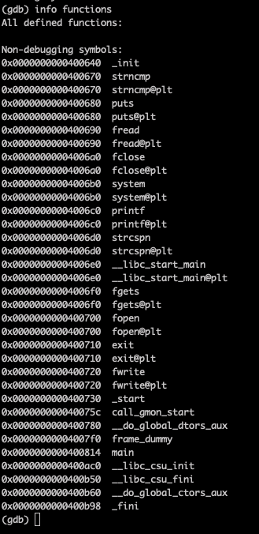
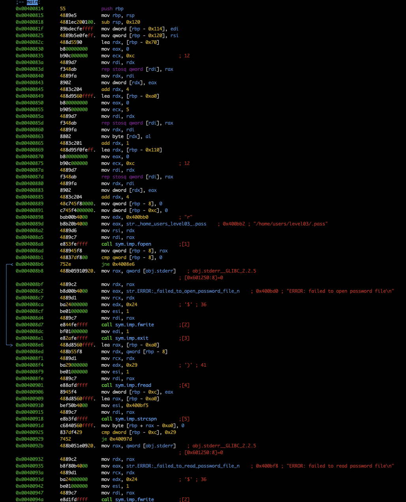
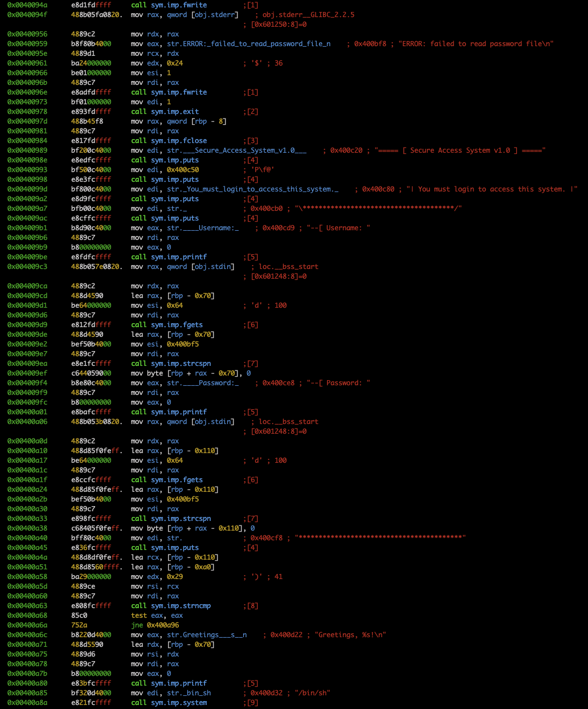
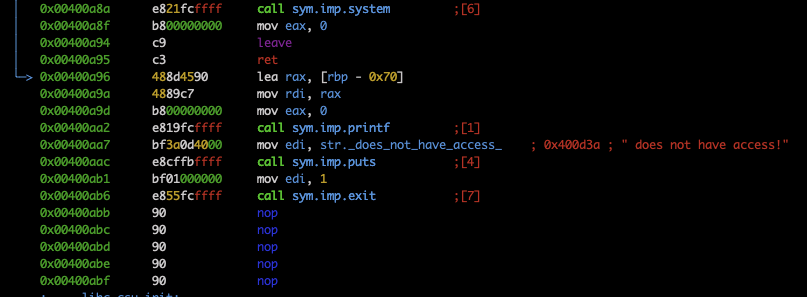

# Check functions

There is only `main`

# Main disass

Wow, `main` reads the file `/home/users/level03/.pass` at the's start into stack variable.
Then it prompts user for username and password, reading from stdin. 
Finally `strncmp` compares the password input by user with the correct password. If the password is correct `system("/bin/sh")` opens the next shell.
