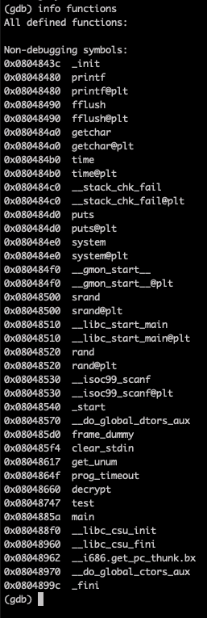
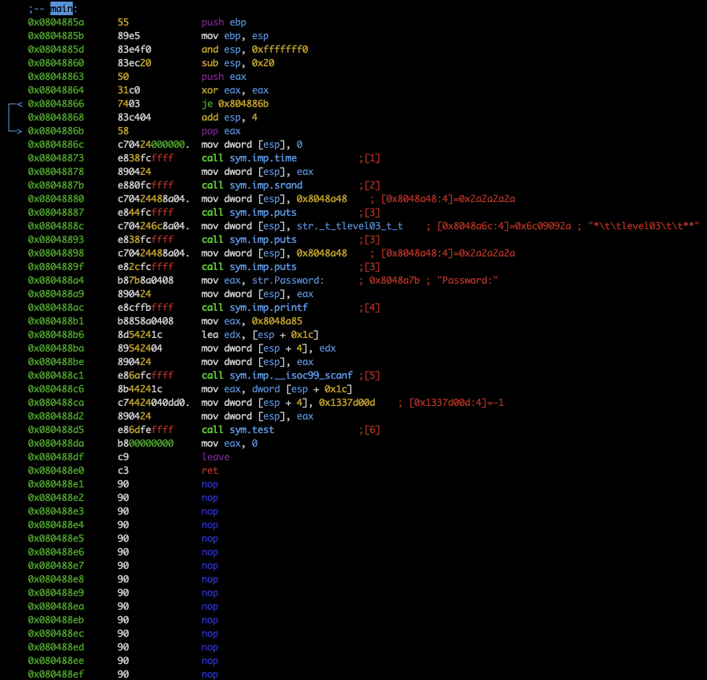
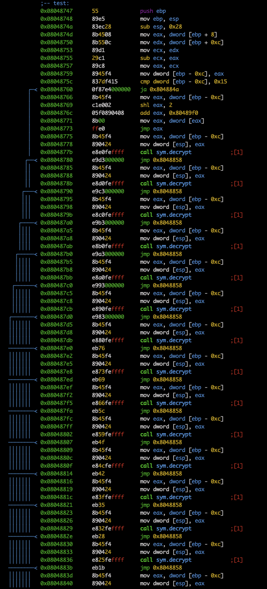
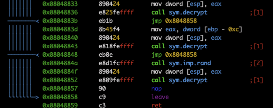
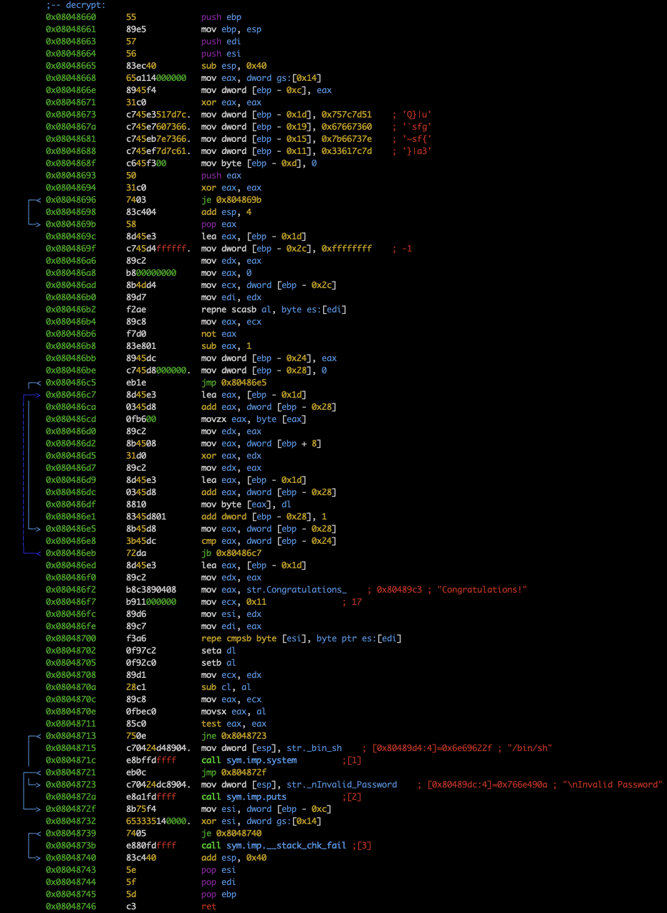

# Check functions

There are `main`, `test`, `decrypt`

# Main disass

It calls a function `test`, with the user input and the number `322424845` (0x1337d00d in hex)

# Test disass

It makes the following calculation: `322424845 - user input` (`sub` instructions). 
If the result is less than 21 (0x15), it calls `decrypt` with the result, else with a random number.

# Decrypt disass

This one passes a crypt over the parameter. If the initial user-inputted password is correct, `decrypt` prints "Congratulations!" and calls `system("/bin/sh")`.
