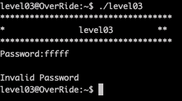
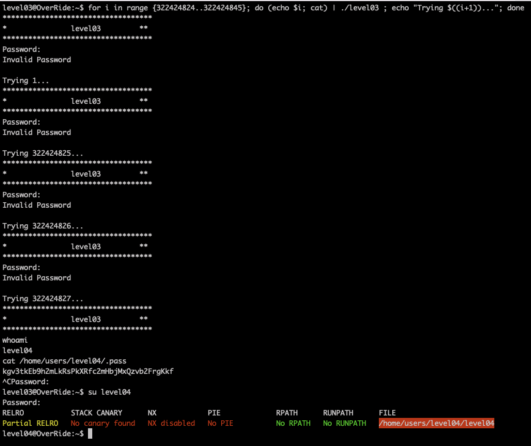

# Level03

The program waits a password as inputs. Let's use [gdb and radare](Ressources/gdb.md) to understand what's going on.

We can see subtraction `322424845 - user input` in `test` and comparing with `21`. If the result of subtraction less than 21, 
it will be passed to `decrypt` and will be decrypted. So, we have 21 potentially passwords:

`322424845 - 21 = 322424824`

in range {322424824, 322424845}. Let's launch a simple circle

`for i in range {322424824..322424845}; do (echo $i; cat) | ./level03 ; echo "Trying $((i+1))..."; done`

