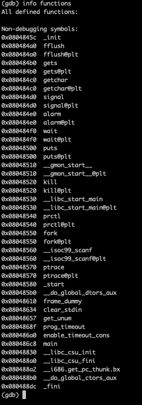
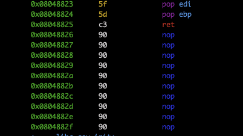

# Check functions

It is interesting only `main`

# Main disass

At first `main` forks a child process, and links the child's return to the parent. Then `gets` reads stdin into a buffer. 
Finally, the child process is killed if it makes a syscall to `exec`: it compares at line with address `0x080487e8` number 0xb (11) with returned code from `ptrace`.
