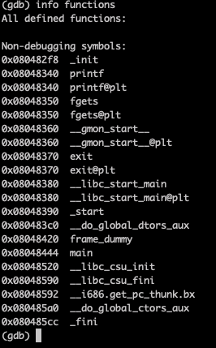
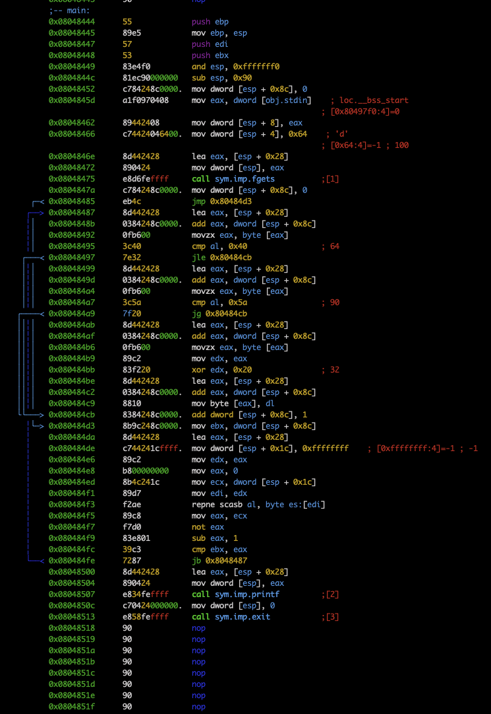

# Check functions

Only `main`

# Main disass

This program is a basic `tolower`, which is of little interest to us. 
However, we see a call to `printf`, which is vulnerable to string format exploits. We also see a call to `exit`.