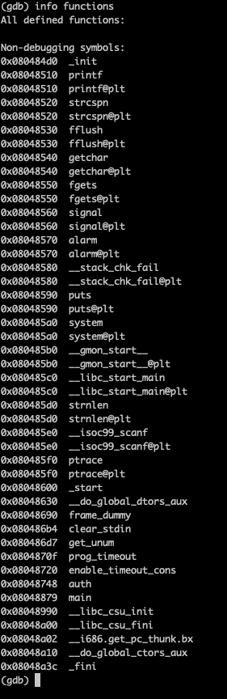
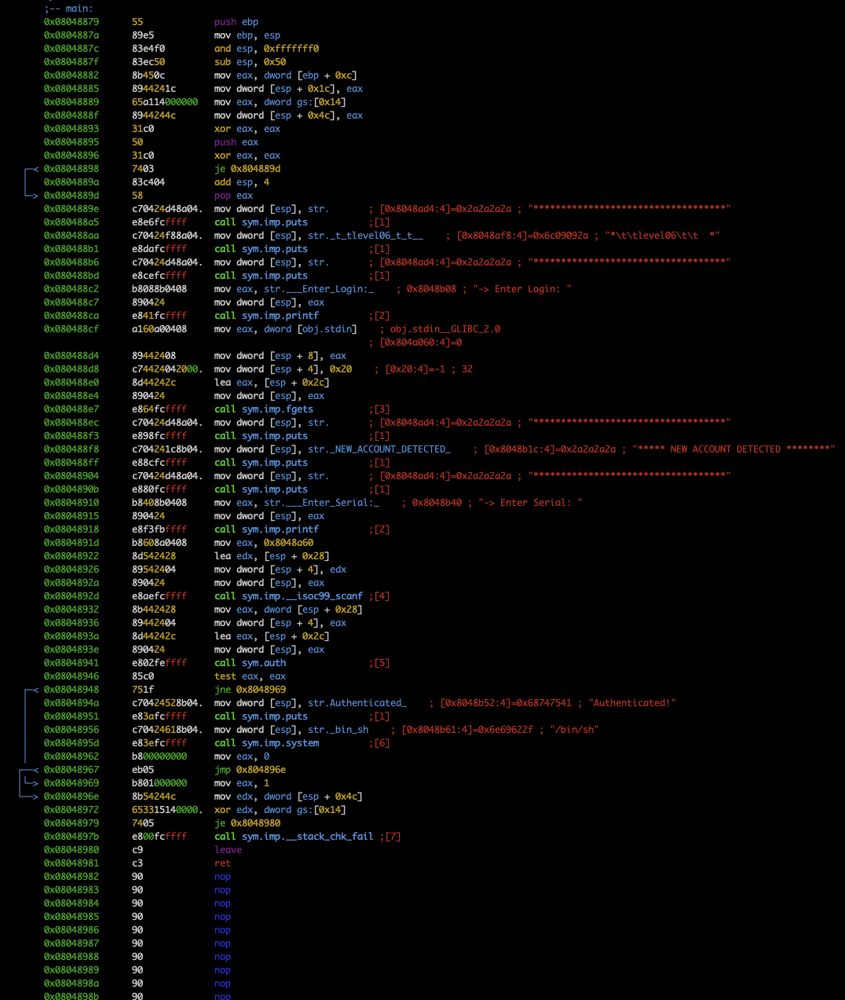
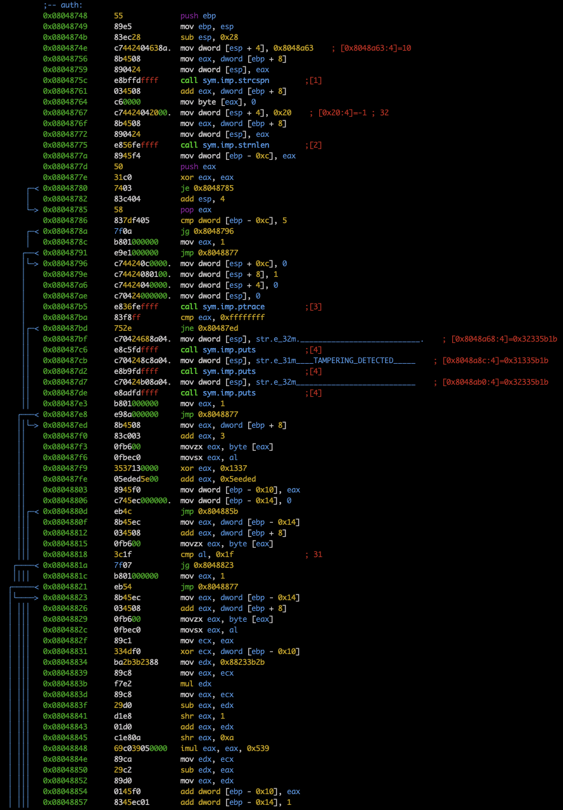
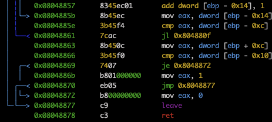

# Check functions

There are `main` and `auth`

# Main disass

It prompts user for Login and Serial, reading them from stdin. 
As the next step, `main` calls `auth`. If `auth` validates the Login and Serial, `system` opens a shell.

# Auth disass

It performs a hashing algorithm on Login, then compares the computed hash with Serial.
