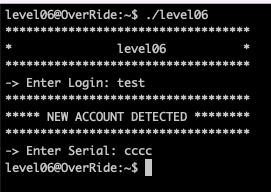
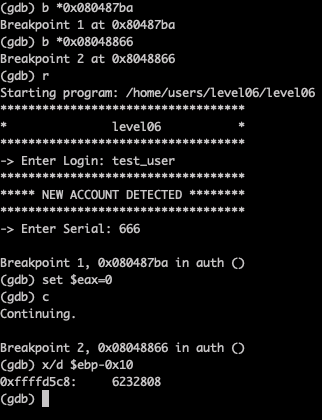
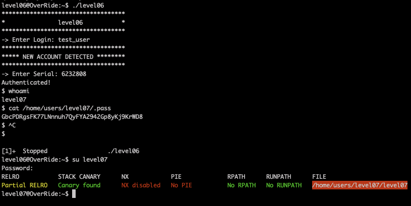

# Level06

The program waits the right input from us. Let's use [gdb and radare](Ressources/gdb.md) to understand what's going on.

Using gdb we can look for the computed hash value (Serial) for a given Login.
However, we can't go directly to the computed hash because `ptrace` detects tampering and exits. 
First we have to put in a break point and modify `ptrace` return to `0` to pass.

Then we can proceed to a second break point where the computed hash is compared with the Serial, here we can print the value of the computed hash.

Our Serial is `6232808` for Login `test_user`

