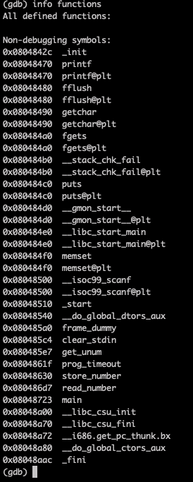
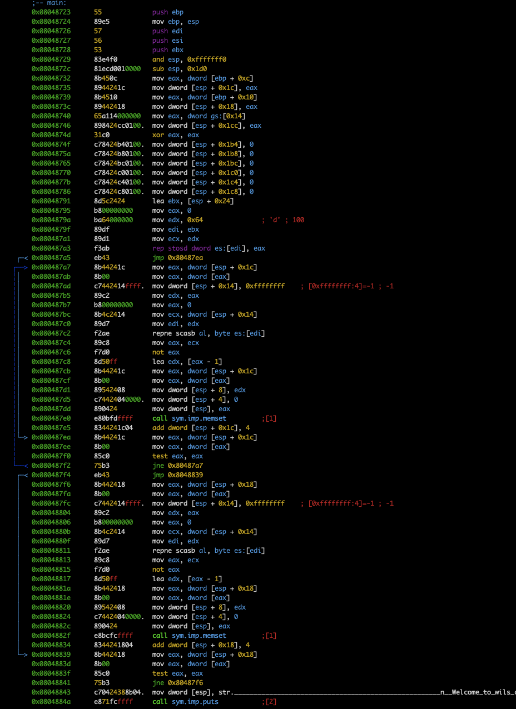
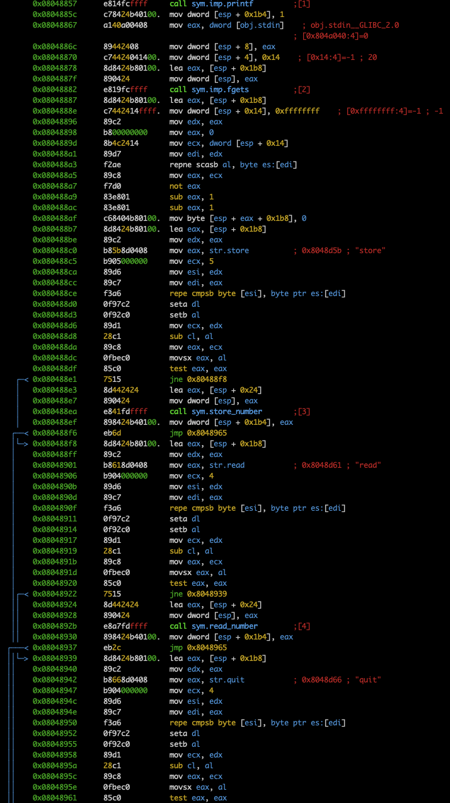
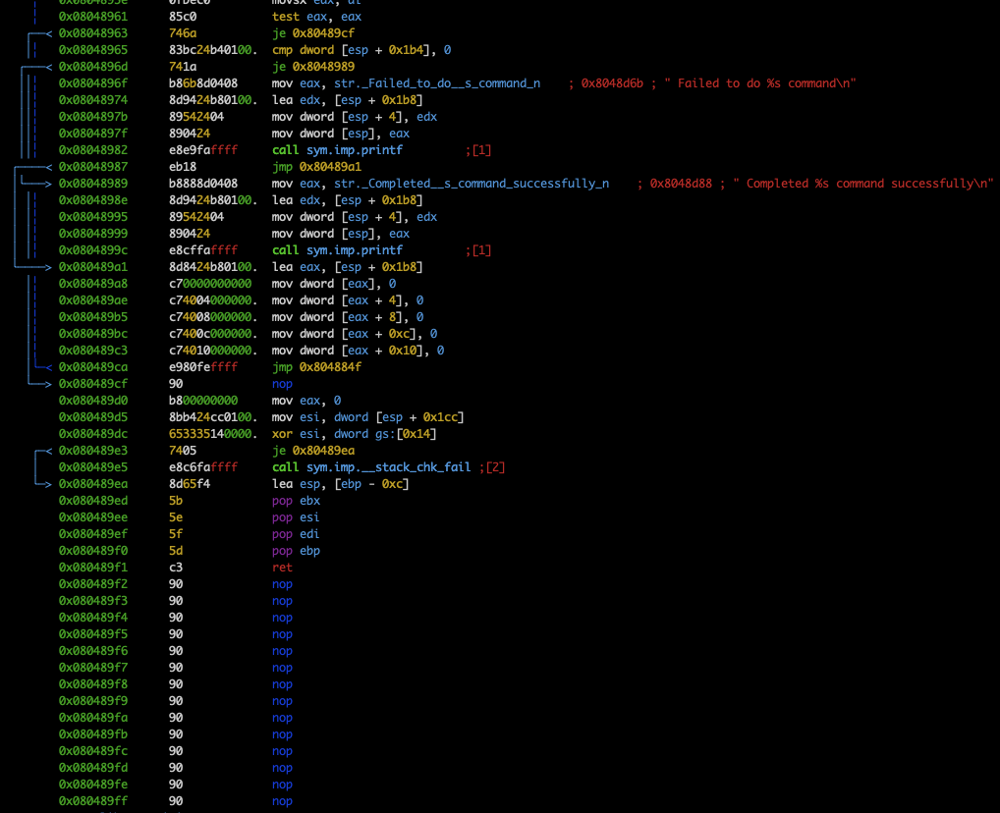
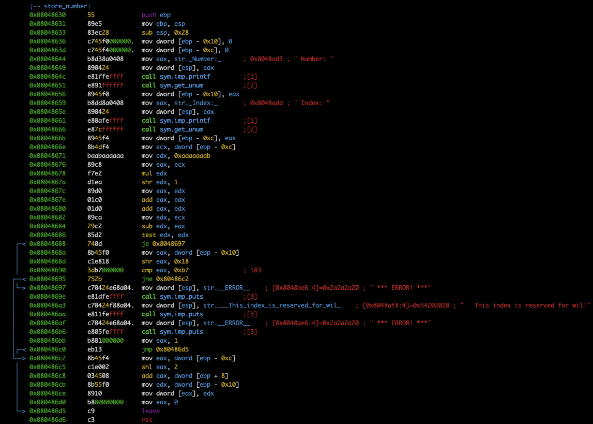
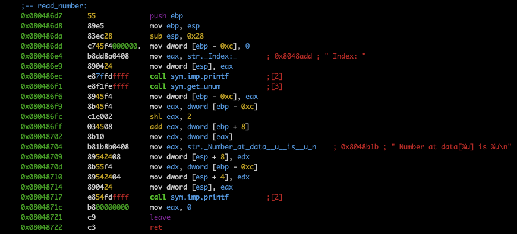

# Check functions

There are `main` and 2 functions for active commands `store_number` and `read_number`

# Main disass

Nothing interesting there

# Store_number disass

We can see protection of some indexes (index % 3 == 0) at the line `0x08048686`.
Also, the table is accessed as `data[index * 4]` (line `0x080486c5` - `shl` command)

# Reead_number disass

We can see the same that as in `store_number`, the uses `shl` command
