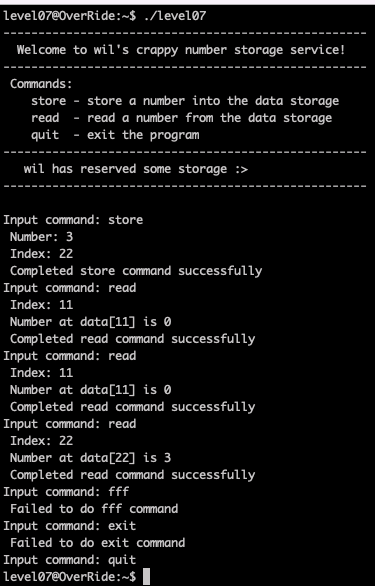
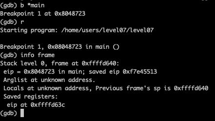
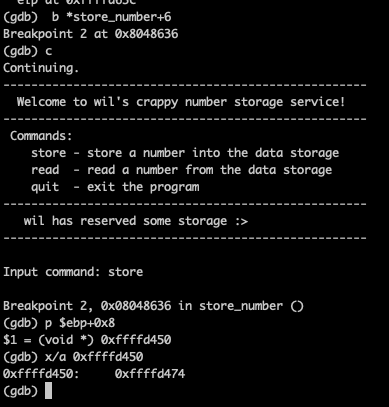
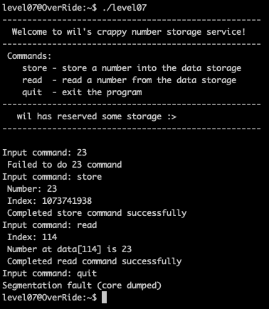
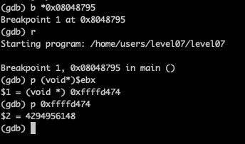
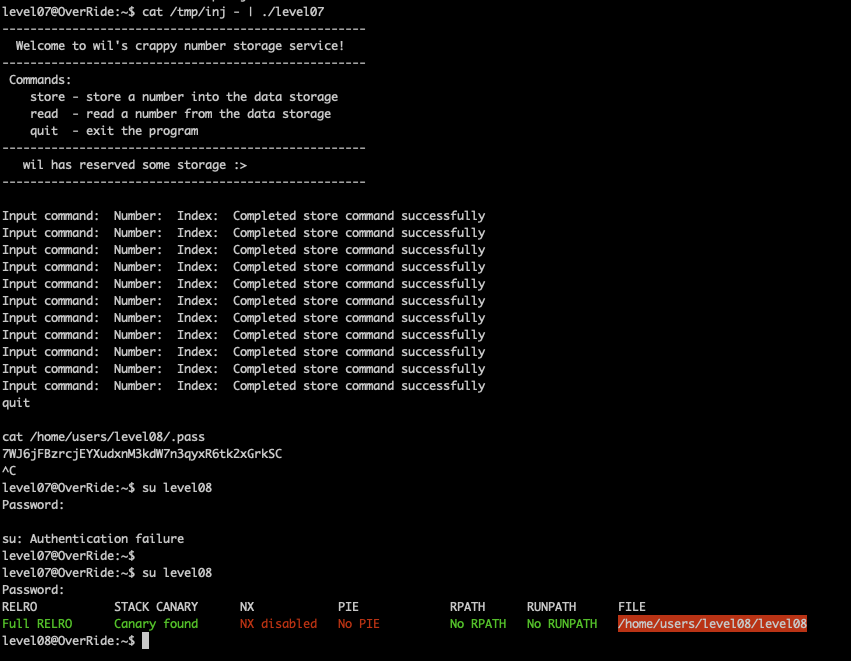

# Level07

It's an interactive program. Let's use [gdb and radare](Ressources/gdb.md) to understand what's going on.

This binary provides a simple number storing interface with three commands:

1. `store`, saves input number (int == 4 bytes) at input index (offset = index * 4).
2. `read`, display number stored at input index.
3. `quit`, exit the program.

This effectively allows us to write anything we want on the stack 4 bytes at a time. 
We will overwrite the `EIP` save to take control of the execution flow and redirect to some shellcode. 
However, there is an input `index % 3` check that prevents us from saving at any index that is divisible by 3. 
To obtain the correct offset to save the value at, the program takes the input index and `shl eax, 2` which effectively multiplies by 4.

To store at an index divisible by 3, we can simply input a value that will overflow to the true index value after the `shl eax, 2`. 
For example, to store at index `0`, we can input `1073741824`

_Vulnerability_:
No check is performed on indexes and an unsigned int table is stored on the stack. This means we can read and store in stack memory.

# Calculate the 'index' of EIP

Once we find the index in the table where we reach EIP, we can then store our payload there using `store_number`

`EIP` address is `0xffffd63c`

The table's address is `0xffffd474`

Next, we need to calculate the 'index' of our EIP address:

    0xffffd63c - 0xffffd474 = 0x1c8 = 456 bytes
    456 / 4 = 114 (index in table)
    114 % 3 = 0

Index 114 is protected. We need to find an unprotected number, which will overflow our index. Use maxint overflow:

    (2^32 / 4) + 114 = 1073741938, which 2^32 - uintmax
    1073741938 % 3 = 1

Index 1073741938 is unprotected!
We can use read command to check if we are storing at the correct index (it should segfault when we quit)

# Injecting our shellcode

This program flushes environment variables and globals at the start of the execution disabling us from using them to store our shellcode. 
We will have to store the shellcode inside the database's buffer. Let's find the address of our buffer:

Because `gdb` adds runtime environment variables, the address of our buffer is inaccurate, adding some `\90` 
instruction padding and increasing our address by `32` bytes is enough to reach it. `4294956148 + 32 = 4294956180`

    \x90\x90\x90\x90 \x90\x90\x90\x90 \x90\x90\x90\x90 \x90\x90\x90\x90 		
    \x6a\x0b\x58\x99 \x52\x68\x2f\x2f \x73\x68\x68\x2f \x62\x69\x6e\x89 		
    \xe3\x31\xc9\xcd \x80

All that is left is placing our shellcode inside the buffer:

- divide into 4 bytes sections 
- reverse them 
- convert to decimal 
- store them starting from index 0 (using the overflow exploit)

To save time debugging we can list in a file all the commands to be passed to the program

