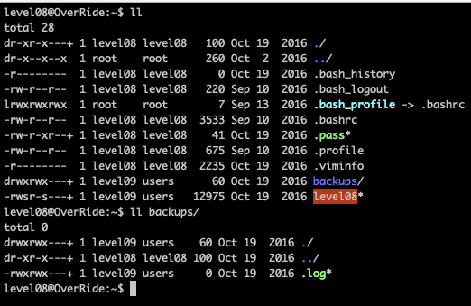
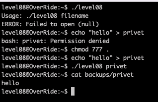
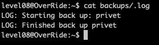
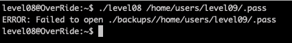
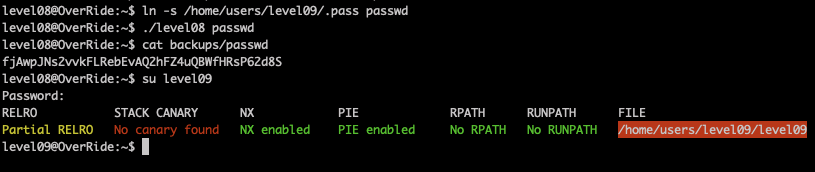

# Level08

We find a binary and directory `backup`, containing `.log`, with owner `level09` SUID

Program waits a file as an argument and makes a copy to the `backups`. Let's use [gdb and radare](Ressources/gdb.md) to understand what's going on.

It writes a log to the `.log` file also.

Let's try to pass file with the next token

Nope, because it doesn't deal with files inside directories, it only works with files in the current directory.

So, in the home directory, we should create a symlink to `/home/users/level09/.pass`. 
Now we can run the binary on the symlink, and it creates a backup of the password file in the `backups` folder

