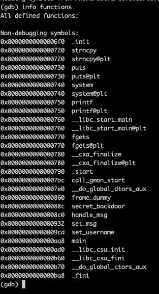
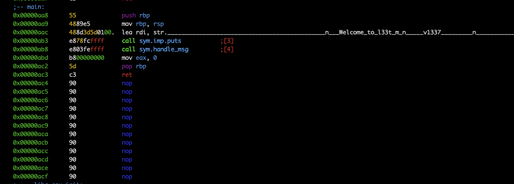
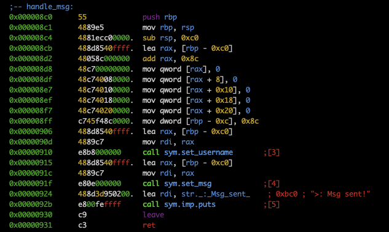
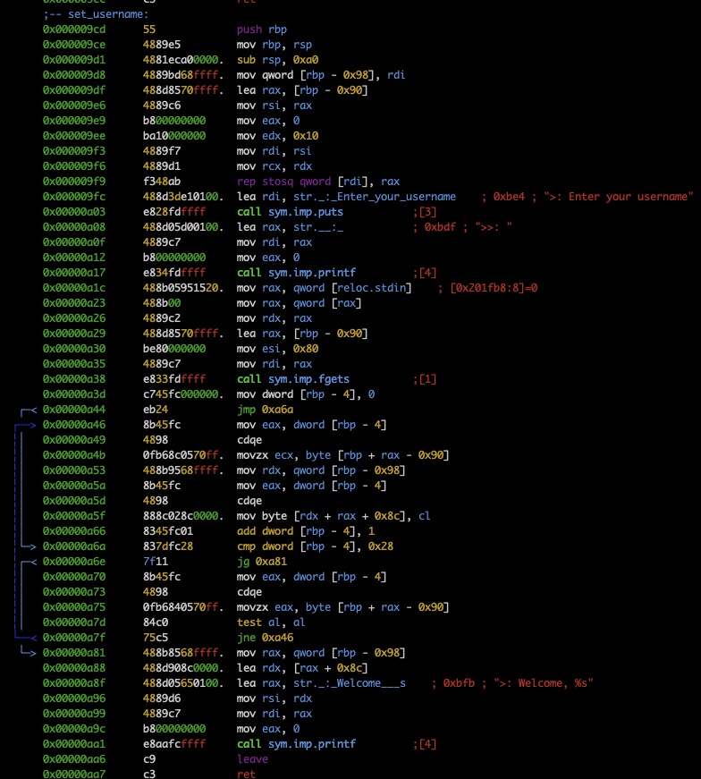
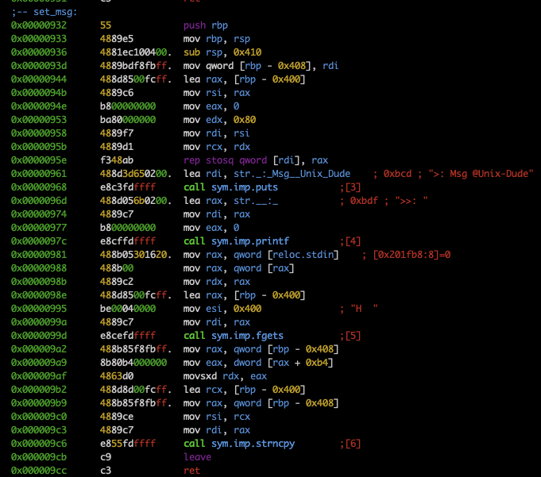
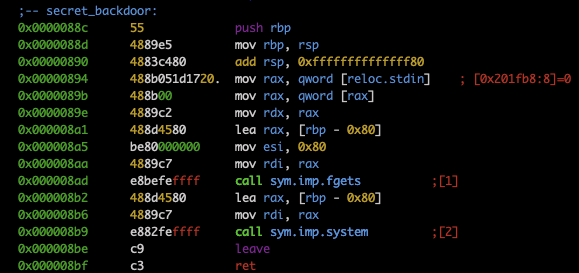

# Check functions

There are `main`, `set_msg`, `set_username`, `handle_msg`, `secret_backdoor`

# Main disass

# Handle_msg disass

# Set_username disass

# Set_msg disass

# Secret_backdoor disass

